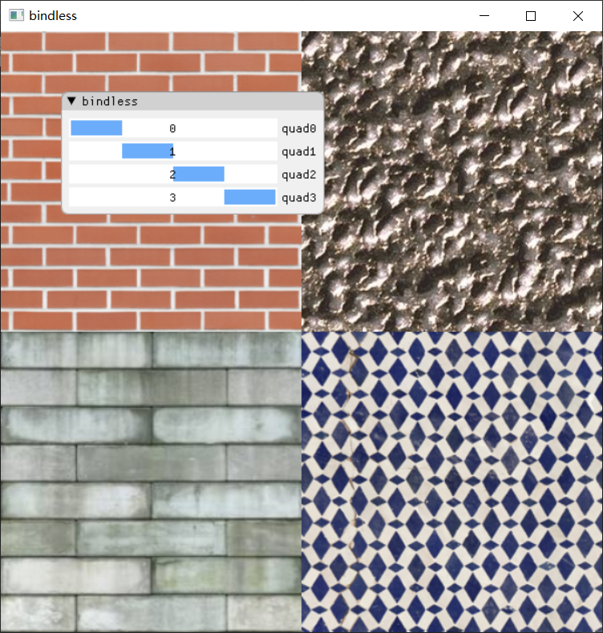

# Efficient Shading

My real-time rendering pipeline playground.

## Forward Rendering

## Deferred Rendering

## Forward Rendering with Pre-depth Pass

## Clustered Forward Rendering

## GPU Culling with Hierarchy-Z Buffer & Indirect Drawing

## Bindless Texture

